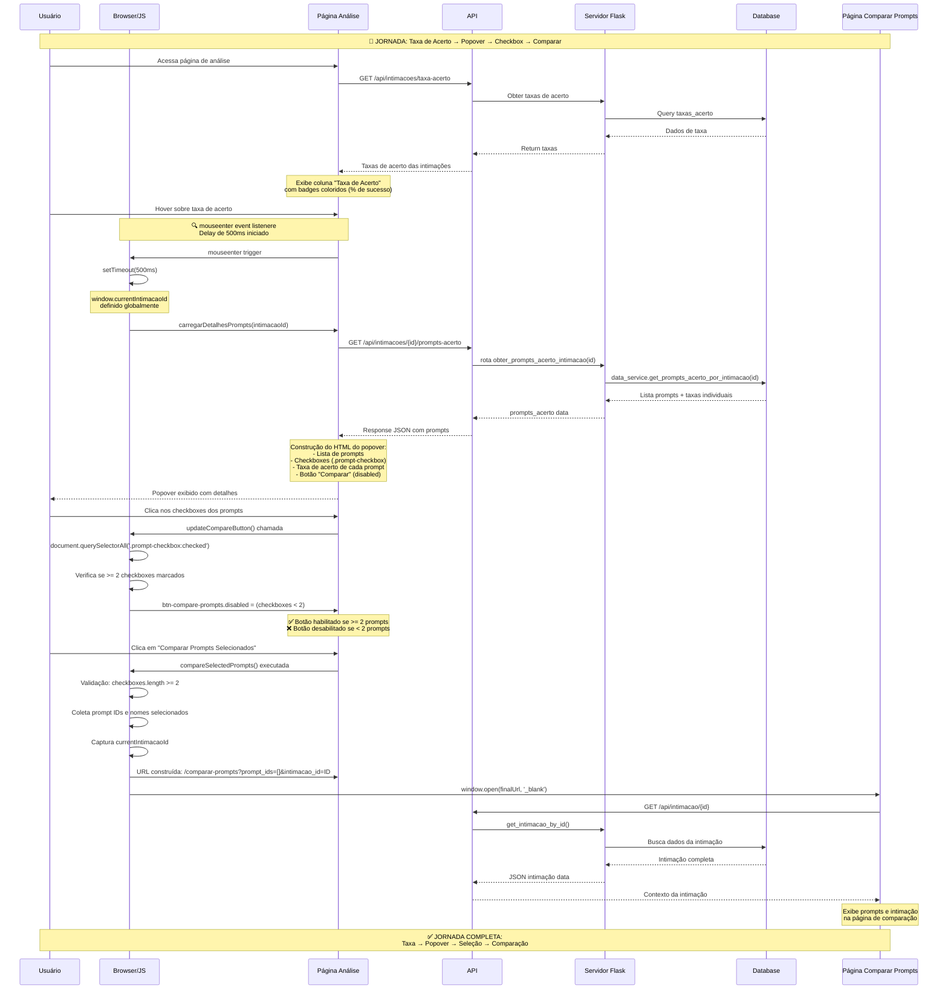

# Diagrama de Sequência - Jornada do Usuário: Comparação de Prompts

## 📊 Diagrama de Sequência da Jornada Completa



## 🔍 Detalhamento Técnico dos Componentes

### **1. Página de Análise (`/analise`)**
- **Coluna Taxa de Acerto**: Exibe percentual global da intimação
- **Popover Trigger**: Hover com delay de 500ms
- **Elementos assinados**: `data-intimacao-id` para identificação

### **2. API Endpoints Utilizadas**
```javascript
// Taxas globais das intimações
GET /api/intimacoes/taxa-acerto

// Detalhes de prompts por intimação
GET /api/intimacoes/{intimacao_id}/prompts-acerto

// Dados da intimação (página de comparação)
GET /api/intimacao/{intimacao_id}
```

### **3. Fluxo JavaScript Principal**

#### **A. Eventos de Hover**
```javascript
// mouseenter event
elemento.addEventListener('mouseenter', function() {
    window.currentIntimacaoId = intimacaoId;
    setTimeout(() => {
        carregarDetalhesPrompts(intimacaoId, popoverElement);
        popoverElement.style.display = 'block';
    }, 500);
});
```

#### **B. Construção do Popover**
```javascript
function carregarDetalhesPrompts(intimacaoId, popoverElement) {
    fetch(`/api/intimacoes/${intimacaoId}/prompts-acerto`)
        .then(response => response.json())
        .then(data => {
            // Constrói HTML com:
            // - Checkboxes (class: .prompt-checkbox)
            // - Taxa de acerto de cada prompt
            // - Botão de comparação (desabilitado)
            // - Event listeners
        });
}
```

#### **C. Controle dos Checkboxes**
```javascript
function updateCompareButton() {
    const checkboxes = document.querySelectorAll('.prompt-checkbox:checked');
    const compareButton = document.getElementById('btn-compare-prompts');
    
    if (checkboxes.length >= 2) {
        compareButton.disabled = false;
    } else {
        compareButton.disabled = true;
    }
}
```

#### **D. Navegação para Comparação**
```javascript
function compareSelectedPrompts() {
    const checkboxes = document.querySelectorAll('.prompt-checkbox:checked');
    const promptIds = Array.from(checkboxes).map(checkbox => checkbox.dataset.promptId);
    const intimacaoId = window.currentIntimacaoId;
    
    const params = new URLSearchParams();
    promptIds.forEach(id => params.append('prompt_ids', id));
    params.append('intimacao_id', intimacaoId);
    
    window.open(`/comparar-prompts?${params.toString()}`, '_blank');
}
```

## 🎭 Estados do Interface Durante a Jornada

### **Estado Inicial**
- Taxa de acerto exibida com badge colorido
- Popover invisível
- Nenhum prompt selecionado

### **Estado de Hover**
- Delay de 500ms iniciado
- Loading spinner no popover
- API request em andamento

### **Estado do Popover Carregado**
- Lista de prompts com checkboxes
- Taxa individual de cada prompt
- Botão "Comparar" desabilitado
- Estado salvo em `popoverElement.dataset.loaded`

### **Estado de Seleção**
- Checkboxes marcados/desmarcados
- Validação em tempo real
- Botão "Comparar" habilitado quando >= 2 prompts

### **Estado Final**
- Redirecionamento para página de comparação
- Nova aba com contexto da intimação
- Prompts comparados lado a lado

## 🔗 Conexões de Dados

### **Global Variables**
```javascript
window.currentIntimacaoId = intimacaoId;  // Definido no mouseenter
```

### **Data Attributes**
```html
<input type="checkbox" 
       class="prompt-checkbox"
       data-prompt-id="uuid"
       data-prompt-nome="nome"
       onchange="updateCompareButton()">
```

### **URL Parameters**
```
/comparar-prompts?prompt_ids=id1&prompt_ids=id2&intimacao_id=intimacao
```

## ⚡ Performance e UX

### **Otimizações Implementadas**
1. **Lazy Loading**: Popover só carrega dados quando necessários
2. **Debounce**: Delay de 500ms para evitar flashes
3. **Cache**: `dataset.loaded = 'true'` evita requisições duplicadas
4. **Validação em Tempo Real**: Checkbox change listeners
5. **State Management**: window.currentIntimacaoId global

### **Tratamento de Erros**
1. **404 Handling**: "Nenhuma análise encontrada"
2. **API Errors**: Fallback para mensagem de erro
3. **Validation**: Mínimo 2 prompts selecionados

---

## 🔧 Detalhamento Técnico - APIs e Classes Servidor

### **API Endpoints - Fluxo Servidor**

#### **Endpoint 1: Taxas Globais**
```
GET /api/intimacoes/taxa-acerto
Flask Handler: obter_taxa_acerto_intimacoes()
Data Service: sqlite_service.get_taxa_acerto_por_intimacao()
SQL Query: SELECT intimacao_id, taxa_acerto, total_analises, acertos
```

#### **Endpoint 2: Prompts por Intimação**
```
GET /api/intimacoes/<id>/prompts-acerto
Flask Handler: obter_prompts_acerto_intimacao(intimacao_id)
Data Service: sqlite_service.get_prompts_acerto_por_intimacao(intimacao_id)
SQL Query: SELECT prompt_id, prompt_nome, taxa_acerto, modelo, temperatura
```

#### **Endpoint 3: Dados da Intimação**
```
GET /api/intimacao/<id>
Flask Handler: get_intimacao_by_id(intimacao_id)
Data Service: sqlite_service.get_intimacao_by_id(intimacao_id)
SQL Query: SELECT * FROM intimacoes WHERE id = ?
```

### **Classes e Métodos Servidor**

#### **SQLiteService.get_prompts_acerto_por_intimacao()**
```python
def get_prompts_acerto_por_intimacao(self, intimacao_id: str) -> List[Dict[str, Any]]:
    """
    Query SQL:
    SELECT 
        a.prompt_id,
        a.prompt_nome,
        COUNT(*) as total_analises,
        SUM(CASE WHEN a.acertou = 1 THEN 1 ELSE 0 END) as acertos,
        ROUND((SUM(CASE WHEN a.acertou = 1 THEN 1 ELSE 0 END) * 100.0 / COUNT(*)), 1) as taxa_acerto,
        a.modelo,
        a.temperatura,
        MAX(a.data_analise) as ultima_analise
    FROM analises a
    WHERE a.intimacao_id = ?
    GROUP BY a.prompt_id, a.prompt_nome, a.modelo, a.temperatura
    ORDER BY taxa_acerto DESC, ultima_analise DESC
    """
```

#### **Comparar Prompts - Página de Destino**
```python
@app.route('/comparar-prompts')
def comparar_prompts():
    """
    1. Parse URL Parameters (prompt_ids, intimacao_id)
    2. Buscar dados dos prompts selecionados
    3. Buscar dados da intimação de origem
    4. Calcular taxas de acerto individuais
    5. Renderizar template comparar_prompts.html
    """
```

### **Frontend - Estrutura do Código HTML/JS**

#### **Estrutura do Popover HTML**
```html
<div class="custom-popover" id="popover-${intimacaoId}">
    <div class="popover-content">
        <div class="popover-body">
            <!-- Carregado dinamicamente via JavaScript -->
            <div class="text-start">
                <div class="fw-bold mb-2">Prompts Testados:</div>
                
                <!-- Para cada prompt -->
                <div class="mb-2 p-2 border rounded prompt-card">
                    <div class="d-flex align-items-start">
                        <div class="me-2 mt-1">
                            <input type="checkbox" 
                                   class="form-check-input prompt-checkbox"
                                   data-prompt-id="${prompt.prompt_id}"
                                   data-prompt-nome="${prompt.prompt_nome}"
                                   onchange="updateCompareButton()">
                        </div>
                        <!-- Nome do prompt clicável -->
                    </div>
                </div>
                
                <!-- Botão de comparação -->
                <div class="mt-3 pt-2 border-top">
                    <button type="button" 
                            class="btn btn-primary btn-sm w-100"
                            id="btn-compare-prompts"
                            onclick="compareSelectedPrompts()"
                            disabled>
                        <i class="bi bi-arrow-left-right"></i>
                        Comparar Prompts Selecionados
                    </button>
                </div>
            </div>
        </div>
    </div>
</div>
```

#### **Função de Construção do Popover**
```javascript
function carregarDetalhesPrompts(intimacaoId, popoverElement) {
    if (popoverElement.dataset.loaded === 'true') return; // Cache
    
    // Loading
    popoverElement.querySelector('.popover-body').innerHTML = '...';
    
    fetch(`/api/intimacoes/${intimacaoId}/prompts-acerto`)
        .then(response => response.json())
        .then(data => {
            if (data.success) {
                const prompts = data.prompts_acerto;
                // Construir HTML dinâmico com prompts + checkboxes
                const content = construirHTMLPrompts(prompts);
                popoverElement.querySelector('.popover-body').innerHTML = content;
                popoverElement.dataset.loaded = 'true';
            }
        });
}
```

#### **Controlo do Botão Compare**
```javascript
function updateCompareButton() {
    const checkboxes = document.querySelectorAll('.prompt-checkbox:checked');
    const compareButton = document.getElementById('btn-compare-prompts');
    
    if (checkboxes.length >= 2) {
        compareButton.disabled = false;
        compareButton.classList.add('active'); // Visual feedback
    } else {
        compareButton.disabled = true;
        compareButton.classList.remove('active');
    }
}
```

#### **Navegação para Comparação**
```javascript
function compareSelectedPrompts() {
    const checkboxes = document.querySelectorAll('.prompt-checkbox:checked');
    
    // Validação
    if (checkboxes.length < 2) {
        showToast('Selecione pelo menos 2 prompts para comparar', 'warning');
        return;
    }
    
    // Coletar dados
    const promptIds = Array.from(checkboxes).map(checkbox => checkbox.dataset.promptId);
    const intimacaoId = window.currentIntimacaoId;
    
    // Construir URL
    const params = new URLSearchParams();
    promptIds.forEach(id => params.append('prompt_ids', id));
    if (intimacaoId) params.append('intimacao_id', intimacaoId);
    
    const url = `/comparar-prompts?${params.toString()}`;
    
    // Abrir nova aba
    window.open(url, '_blank');
}
```

---

## 📊 Resumo da Jornada

**Entrada**: Usuário acessa página de análise  
**Trigger**: Hover sobre taxa de acerto (delay 500ms)  
**Carregamento**: API `/api/intimacoes/<id>/prompts-acerto` busca dados  
**Interação**: Checkboxes ativam `.prompt-checkbox` listeners  
**Validação**: `updateCompareButton()` verifica >= 2 prompts  
**Navegação**: `compareSelectedPrompts()` constrói URL e abre nova aba  
**Resultado**: `/comparar-prompts?prompt_ids=[]&intimacao_id=X` página de comparação

A jornada é fluida e responsiva, com feedback visual em cada etapa!
