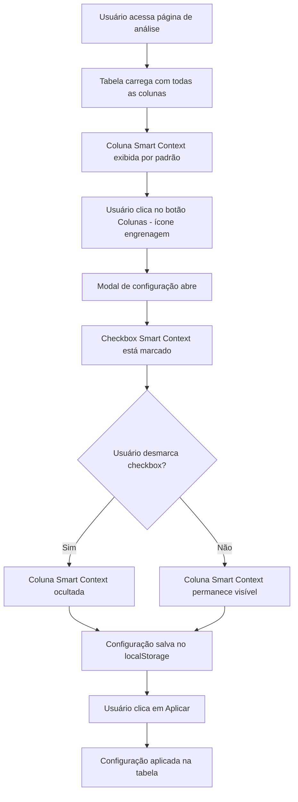

# 📊 Diagrama de Modificações - Coluna Smart Context

## 🎯 Objetivo
Adicionar coluna "Smart Context" na tabela de intimações da página de análise, com controle de visibilidade através do botão "Colunas" (ícone de engrenagem).

---

## 📋 Modificações Realizadas

### **1. Estrutura HTML da Tabela**

#### **1.1. Cabeçalho da Tabela (thead)**
```html
<!-- ANTES -->
<th class="col-classe" style="width: 10%;">Classe</th>
<th class="col-classificacao" style="width: 12%;">Classificação Manual</th>

<!-- DEPOIS -->
<th class="col-classe" style="width: 10%;">Classe</th>
<th class="col-smart-context" style="width: 8%;">Smart Context</th>
<th class="col-classificacao" style="width: 12%;">Classificação Manual</th>
```

**Localização:** `templates/analise.html` - Linha 317

---

#### **1.2. Corpo da Tabela (tbody)**
```html
<!-- ANTES -->
<td class="col-classe">
    
    <span class="badge bg-secondary">{{ intimacao.classe }}</span>
    
    <span class="text-muted">-</span>
    
</td>
<td class="col-classificacao classificacao-cell">

<!-- DEPOIS -->
<td class="col-classe">
    
    <span class="badge bg-secondary">{{ intimacao.classe }}</span>
    
    <span class="text-muted">-</span>
    
</td>
<td class="col-smart-context">
    
    <span class="badge bg-success" title="Esta intimação utiliza contexto inteligente">
        <i class="bi bi-check-circle"></i> Sim
    </span>
    
    <span class="badge bg-secondary" title="Esta intimação não utiliza contexto inteligente">
        <i class="bi bi-x-circle"></i> Não
    </span>
    
</td>
<td class="col-classificacao classificacao-cell">
```

**Localização:** `templates/analise.html` - Linhas 360-370

**Características:**
- Badge verde (`bg-success`) com ícone de check quando `smart_context = true`
- Badge cinza (`bg-secondary`) com ícone de X quando `smart_context = false`
- Tooltip explicativo em ambos os casos

---

### **2. Modal de Configuração de Colunas**

#### **2.1. Checkbox no Modal**
```html
<!-- ANTES -->
<div class="form-check">
    <input class="form-check-input" type="checkbox" id="col-classe" checked>
    <label class="form-check-label" for="col-classe">Classe</label>
</div>
<div class="form-check">
    <input class="form-check-input" type="checkbox" id="col-classificacao" checked>
    <label class="form-check-label" for="col-classificacao">Classificação Manual</label>
</div>

<!-- DEPOIS -->
<div class="form-check">
    <input class="form-check-input" type="checkbox" id="col-classe" checked>
    <label class="form-check-label" for="col-classe">Classe</label>
</div>
<div class="form-check">
    <input class="form-check-input" type="checkbox" id="col-smart-context" checked>
    <label class="form-check-label" for="col-smart-context">Smart Context</label>
</div>
<div class="form-check">
    <input class="form-check-input" type="checkbox" id="col-classificacao" checked>
    <label class="form-check-label" for="col-classificacao">Classificação Manual</label>
</div>
```

**Localização:** `templates/analise.html` - Linhas 827-832

---

### **3. JavaScript - Controle de Visibilidade**

#### **3.1. Função `aplicarConfigColunasIntimacoes()`**
```javascript
// ANTES
const colunas = [
    'col-checkbox', 'col-defensor', 'col-classe', 'col-classificacao',
    'col-informacoes', 'col-taxa', 'col-data', 'col-acoes'
];

// DEPOIS
const colunas = [
    'col-checkbox', 'col-defensor', 'col-classe', 'col-smart-context', 'col-classificacao',
    'col-informacoes', 'col-taxa', 'col-data', 'col-acoes'
];
```

**Localização:** `templates/analise.html` - Linha 2191

---

#### **3.2. Função `resetarColunasIntimacoes()`**
```javascript
// ANTES
const colunas = [
    'col-checkbox', 'col-defensor', 'col-classe', 'col-classificacao',
    'col-informacoes', 'col-taxa', 'col-data', 'col-acoes'
];

// DEPOIS
const colunas = [
    'col-checkbox', 'col-defensor', 'col-classe', 'col-smart-context', 'col-classificacao',
    'col-informacoes', 'col-taxa', 'col-data', 'col-acoes'
];
```

**Localização:** `templates/analise.html` - Linha 2228

---

#### **3.3. Função `aplicarConfigColunasIntimacoesSemFecharModal()`**
```javascript
// ANTES
const colunas = [
    'col-checkbox', 'col-defensor', 'col-classe', 'col-classificacao',
    'col-informacoes', 'col-taxa', 'col-data', 'col-acoes'
];

// DEPOIS
const colunas = [
    'col-checkbox', 'col-defensor', 'col-classe', 'col-smart-context', 'col-classificacao',
    'col-informacoes', 'col-taxa', 'col-data', 'col-acoes'
];
```

**Localização:** `templates/analise.html` - Linha 2257

---

### **4. CSS - Ajuste de Larguras**

#### **4.1. Regras CSS para Colunas**
```css
/* ANTES - Colunas até a 7ª */
.intimacoes-cards-table th:nth-child(4),
.intimacoes-cards-table td:nth-child(4) {
    width: 20% !important;
}

.intimacoes-cards-table th:nth-child(5),
.intimacoes-cards-table td:nth-child(5) {
    width: 12% !important;
}

.intimacoes-cards-table th:nth-child(6),
.intimacoes-cards-table td:nth-child(6) {
    width: 10% !important;
}

.intimacoes-cards-table th:nth-child(7),
.intimacoes-cards-table td:nth-child(7) {
    width: 8% !important;
}

/* DEPOIS - Colunas até a 10ª (adicionada Smart Context) */
.intimacoes-cards-table th:nth-child(4),
.intimacoes-cards-table td:nth-child(4) {
    width: 10% !important;  /* Classe */
}

.intimacoes-cards-table th:nth-child(5),
.intimacoes-cards-table td:nth-child(5) {
    width: 8% !important;  /* Smart Context - NOVO */
}

.intimacoes-cards-table th:nth-child(6),
.intimacoes-cards-table td:nth-child(6) {
    width: 12% !important;  /* Classificação Manual */
}

.intimacoes-cards-table th:nth-child(7),
.intimacoes-cards-table td:nth-child(7) {
    width: 15% !important;  /* Informações Adicionais */
}

.intimacoes-cards-table th:nth-child(8),
.intimacoes-cards-table td:nth-child(8) {
    width: 10% !important;  /* Taxa de Acerto */
}

.intimacoes-cards-table th:nth-child(9),
.intimacoes-cards-table td:nth-child(9) {
    width: 10% !important;  /* Data de Criação */
}

.intimacoes-cards-table th:nth-child(10),
.intimacoes-cards-table td:nth-child(10) {
    width: 8% !important;  /* Ações */
}
```

**Localização:** `templates/analise.html` - Linhas 1050-1083

**Observação:** Todas as larguras foram reajustadas para acomodar a nova coluna.

---

## 🔄 Fluxo de Funcionamento



---

## 📍 Posicionamento da Coluna

### **Ordem das Colunas (da esquerda para direita):**

1. **Checkbox** (seleção)
2. **Card da Intimação** (25%)
3. **Defensor** (10%)
4. **Classe** (10%)
5. **Smart Context** ⭐ **NOVO** (8%)
6. **Classificação Manual** (12%)
7. **Informações Adicionais** (15%)
8. **Taxa de Acerto** (10%)
9. **Data de Criação** (10%)
10. **Ações** (8%)

---

## 🎨 Visual da Coluna

### **Quando `smart_context = true`:**
```
┌─────────────────┐
│ ✓ Sim          │  ← Badge verde (bg-success)
└─────────────────┘
```

### **Quando `smart_context = false`:**
```
┌─────────────────┐
│ ✗ Não          │  ← Badge cinza (bg-secondary)
└─────────────────┘
```

---

## ✅ Funcionalidades Implementadas

1. ✅ **Coluna no cabeçalho** - Adicionada após "Classe"
2. ✅ **Célula no corpo** - Exibe badge verde (Sim) ou cinza (Não)
3. ✅ **Checkbox no modal** - Integrado ao sistema de configuração
4. ✅ **Controle JavaScript** - 3 funções atualizadas
5. ✅ **CSS ajustado** - Larguras reajustadas para todas as colunas
6. ✅ **Persistência** - Configuração salva no localStorage
7. ✅ **Tooltip** - Explicação ao passar o mouse

---

## 🔍 Arquivos Modificados

- **`templates/analise.html`**
  - Linha 317: Cabeçalho da coluna
  - Linhas 360-370: Célula da coluna
  - Linhas 827-832: Checkbox no modal
  - Linhas 1050-1083: CSS de larguras
  - Linha 2191: Função `aplicarConfigColunasIntimacoes()`
  - Linha 2228: Função `resetarColunasIntimacoes()`
  - Linha 2257: Função `aplicarConfigColunasIntimacoesSemFecharModal()`

---

## 📝 Notas Técnicas

1. **Backend não precisa de modificação** - O campo `smart_context` já existe no banco SQLite e é retornado pelo `data_service.get_all_intimacoes()`

2. **Valor do campo** - O campo `smart_context` é um BOOLEAN no SQLite:
   - `1` ou `True` = Smart Context ativado
   - `0` ou `False` = Smart Context desativado

3. **Compatibilidade** - A modificação é totalmente compatível com o sistema existente de configuração de colunas

4. **Performance** - Nenhum impacto na performance, pois apenas adiciona uma coluna na renderização

---

## 🎯 Resultado Final

A coluna "Smart Context" agora aparece na tabela de intimações, mostrando visualmente se cada intimação utiliza contexto inteligente ou não. A coluna pode ser ocultada/exibida através do botão "Colunas" (ícone de engrenagem), assim como todas as outras colunas da tabela.

